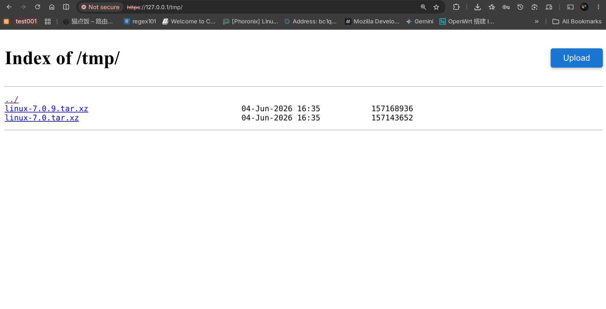

# Patched NGINX Autoindex Upload

This repository is based on the official NGINX source code with a small patch applied to the autoindex page. The patch adds an upload UI to the directory listing page, making it convenient to upload files directly from the browser.

The screenshot below shows the patched autoindex page with the upload feature enabled:



## Build Requirement

The upload feature uses NGINX WebDAV support for HTTP `PUT` uploads. When configuring the build, include the HTTP DAV module:

```sh
./configure --with-http_dav_module
make
```

You can add any other NGINX build options you need, but `--with-http_dav_module` is required for uploads to work.

## NGINX Configuration

Add a location like this to your `nginx.conf`:

```nginx
location /tmp/ {
    alias /tmp/output/;
    autoindex on;
    dav_methods PUT;
    create_full_put_path on;
    client_max_body_size 2048m;
}
```

This configuration serves `/tmp/output/` at `/tmp/`, enables the patched autoindex directory page, and allows browser uploads through HTTP `PUT`.

## Notes

- `autoindex on;` enables the directory listing page where the upload UI is shown.
- `dav_methods PUT;` enables file uploads.
- `create_full_put_path on;` allows NGINX to create missing directories for uploaded paths.
- `client_max_body_size 2048m;` allows uploads up to 2 GB. Adjust this value for your deployment.
- Make sure the NGINX worker process has write permission to the target directory, for example `/tmp/output/`.
